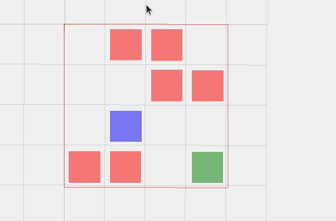

## Q-Learning

Aims:

- [x] Basic Q-Learning
- [ ] Explore OpenAI Gym package
- [ ] DQN


### Basic Q-Learning with Maze

Thanks to Jariullah Safi

#### With Random moves.
```python
import random
m = make_test_maze()
final_score = 0
while not m.has_won():
    moves = m.compute_possible_moves()
    random.shuffle(moves)
    final_score += m.do_a_move(moves[0])
    print(moves[0])
    m.visualize3d()
```
> Blue box: Agent

> Green box: Target.

> Red boxes: Invalid moves. 


