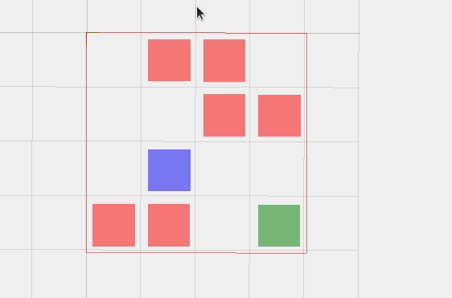
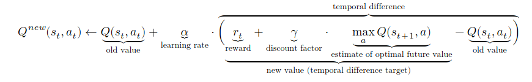
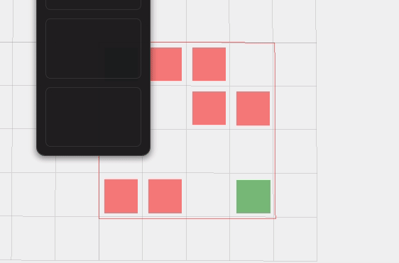

## Basic Q-Learning with Maze

Thanks to [Jariullah Safi's](https://github.com/safijari) incredible stream in Twitch.

#### With Random moves.
> Blue box: Agent

> Green box: Target.

> Red boxes: Invalid moves. 


```python
import random
m = make_test_maze()
final_score = 0
while not m.has_won():
    moves = m.compute_possible_moves()
    random.shuffle(moves)
    final_score += m.do_a_move(moves[0])
    print(moves[0])
    m.visualize3d()
```



### Q-Learning using Bellam Equation

Using Bellman equation to update value function.



#### Notice it is much more consistent with its moves.

I've used ```time.sleep(0.5)``` for better view of our agent's moves.

