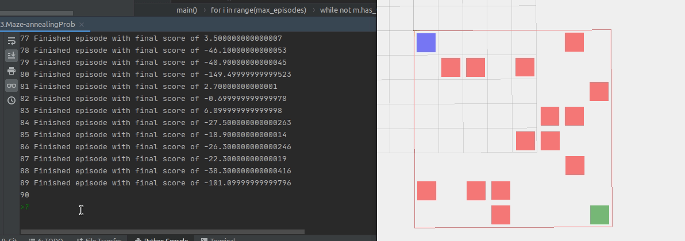

## Basic Q-Learning with Maze

Thanks to [Jariullah Safi's](https://github.com/safijari) incredible stream in Twitch.

#### 01. With Random moves.
> Blue box: Agent

> Green box: Target.

> Red boxes: Invalid moves. 


```python
import random
m = make_test_maze()
final_score = 0
while not m.has_won():
    moves = m.compute_possible_moves()
    random.shuffle(moves)
    final_score += m.do_a_move(moves[0])
    print(moves[0])
    m.visualize3d()
```


### 02. Q-Learning using Bellam Equation

Using Bellman equation to update value function.


#### Notice it is much more consistent with its moves.

I've used ```time.sleep(0.5)``` for better vigew of our agent's moves.


### 03. Exploration vs Exploitation

<strong>Using annealing probability function.</strong>

> The algorithm explores unless legit moves have some positive Q values. Then it starts exploring.

```python
# Exploration
if random.random() > anneal_probability(i, max_episodes, switch_episodes, 0.5) or i < switch_episodes:
    # list me all the moves possible for the agent
    moves = m.compute_possible_moves()
    # shuffle the moves
    random.shuffle(moves)
    # move: tuple, move_idx: bottom(0), top(1), left (2), right(3)
    move, move_idx = moves[0]
# Exploitation
else:
    moves = m.all_actions
    s = m.state_for_agent(m.mousy)
    move_idx = np.argmax(q.q[s])
    move = moves[move_idx]
```


